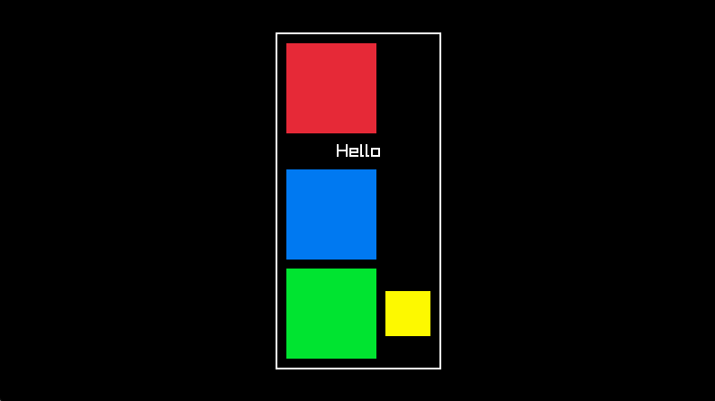

# Raylib UI DSL
A DSL for formatting and drawing UI's using Raylib and C.

## Example

This code:
```C
UIInit(builder);

UIBorder(builder, 2, WHITE);
    UIPadding(builder, 12);
        UIColumn(builder, 10);
            UIText(builder, "Hello", 32, WHITE);
            UIText(builder, "World", 32, WHITE);
        UIColumnEnd(builder);
    UIPaddingEnd(builder);
UIBorderEnd(builder);

UIDraw(builder, (Vector2){100, 100});
```

Produces this output:



## Purpose
Hard-coding the formatting for menus, textboxes and the like is tedious, error-prone, and extremely difficult to refactor.

The design goals are as follows:
* Provide a declarative, HTML-like syntax for specifying UI elements.
* Support dynamically-sized elements. Container elements like rows, columns, and borders should snugly fit around their contents without the programmer having to explicitly give sizes and positions of elements.
* Combine seamlessly alongside the existing 2D drawing capabilities of Raylib.

## How to Use It
1. Copy `ui.c` and `ui.h` into C project and add a line to your makefile so that `uic.c` is included in the builder. You can use this project's makefile as an example.

2. Import "ui.h" into your main file.

3. After calling Raylib's `InitWindow` function, allocate a `UIBuilder`. The parameter to this function is the maximum number of tokens that will be in the UI. This corresponds exactly to the number of times you call functions like `UIText` and `UIRow`.
```
UIBuilder *builder = UIBuilderAlloc(1024);
```


4. After calling Raylib's `BeginDrawing` function, call `UIBuilderInit(builder)` to reset the internal state of the `UIBuilder`.

5. Declare a UI.

6. Call `UIBuilderDraw(builder,origin)`, where `origin` is a Raylib `Vector2` that specifies the top-left corner of the UI.

## UI Reference
* `UIRect` - specifies a colored rectangle. This eventually invokes Raylib's `DrawRect` function.

* `UIText` - declare text of a given color and size. This eventually invokes Raylib's `DrawText` function.

* `UIRow` - declare that the next elements will be arranged in a row. You must use the `UIRowEnd` function to declare the end of the row.

* `UIColumn` - like `UIRow`, but it declares a column.

* `UIAlignH` - declare that the next element will be aligned in a given width. Possible alignments are `LEFT`, `CENTER`, and `RIGHT`. You must use the `UIAlignHEnd` function after declaring the aligned element.

* `UIAlignV` - like `UIAlignH`, but it aligns the next element vertically. The aligned element must be followed by `UIAlignVEnd`.

* `UIPadding` - declare that the next element will have padding. You must call the `UIPaddingEnd` function after declaring the padded element.

* `UIBorder` - declare that the nexet element will have a border around it. You must call the `UIBorderEnd` function after declaring the bordered element. This eventualy calls Raylib's `DrawRectangleLinesEx` function. The border is drawn *just inside* the element's bounds, so you don't need to worry about the border overlapping a neighboring element.

## How it Works
I may do a write-up on this eventually.

TL;DR The `UIBuilder` holds a list of tokens and a stack of contexts. 

Calling a function like `UIRect` pushes a token to the list.

The list of tokens is processed in 2 passes. First, the size of all elements is determined. Then, the positions are determined and the elements are drawn.

